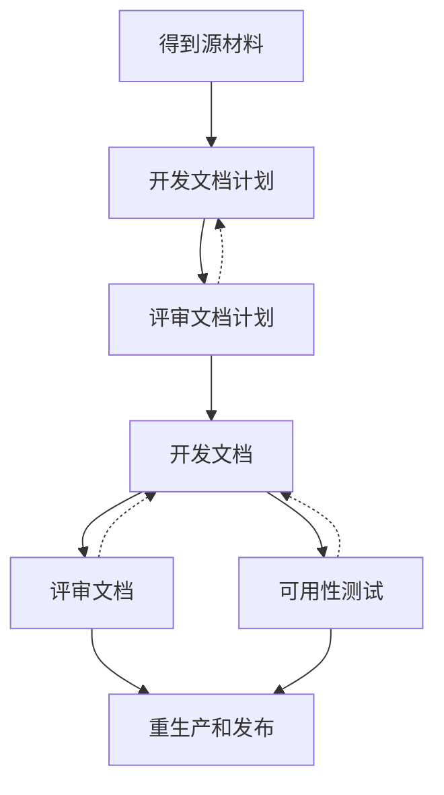

# 文档过程

## 概述

有两种主要类型的标准：

1. 产品标准，它规定产品的特征和功能需求；
2. 过程标准，它规定开发产品的过程。

应用程序和计算机软件的复杂性日益增加，使得给使用计算机的用户提供完整的、正确的和易懂的文档的需要更加迫切。
本标准通过规定影响软件文档的质量的活动（做什么和由谁做），提供达到这些目的的工具。

文档常常是关心在软件已经实现后做些什么。
然而，为了质量，软件文档编制应作为整个软件生产过程的一部分。
过程计划应把文档计划包括在内。
本标准也给用户和客户提供工具以保证文档过程实施。

本标准的主要活动是建立开发文档的广泛计划。
这是必须的，因为有计划，文档编制的质量会更好，过程的效率会更高。
计划必须包括风格规格说明。
本标准不规定风格规格说明的内容（即不规定具体的布局和字体），但它规定风格规格说明必须覆盖什么。
本标准也规定何种信息对于文档管理者是可用的和谁做评审和再生产文档。

本标准遵循 GB/T 8566—2001《信息技术 软件生存周期过程》。
为其开发过程和管理过程中的主要文档规定了编制规范。

本标准是按文档由专门的文档管理人员和文本编写人员的模式规定的。
具体的项目可根据具体情况安排。

文档过程的活动应按图1中的顺序执行。

其中，有两个阴影框。
在一个阴影框中的所有活动应在下一个阴影框中的活动开始之前完成。
在阴影框中的活动可以并行执行。虚线指示可能的重复。

在文档的最小内容已经由需方规定的情况下，这宜由文档管理者在文档计划开发期间纳入。

